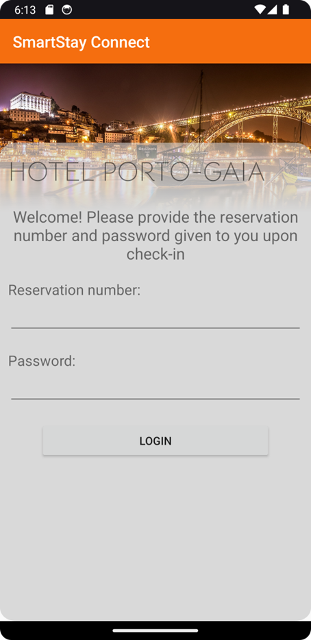

# SmartStay Connect

Student: Francisco Rebêlo, a16443 [@moreira-rebelo](https://www.github.com/moreira-rebelo)\
Teacher: Luis Gonçalves\
Course: Licenciatura em Engenharia de Sistemas Informáticos\
School: Instituto Politécnico do Cávado e do Ave - Escola Superior de tecnologia\
Curricular Unit: Mobile Devices Programming

The GitHub repository can be viewed [here](https://github.com/moreira-rebelo/ProjetoAplicadoG09)

## Contextualization

The Curricular Unit (CU) of Applied Project (AP) consists in the development of a project.
This project, typically involves other CUs of the same semester such as Information Systems Integration (ISI), Embedded Systems and of Real Time (ESRT) and Mobile Devices Programming (MDG).\

The project chosen is called SmartStay Connect and consists in a system for the hotel industry that aims to bring convenience and utility for the hotel guests.\
What we proposed to do is a system that allows users to open their hotel room and also control the air conditioning of the same room using a mobile app.\

The project was made in three parts:
- The physical environment and real world data acquisition is made using an Arduino and is integrated in the ESRT CU.
- The database communication and user authentication is done using an restfull API developed in the ISI UC.
- And finally the interface for the user is made using an Android APP developed in the MDG UC.
## Introduction to the project

The objective of this specific project of developing the Android APP using the knowledge acquired during the semester in order to give the user of the above said project a means to interact with their room. Given its simplicity, it's crucial to emphasize that this app was developed individually.\
The project also has to integrate the projects made in the other CUs referred above.
## How it works

When the user opens the app, it is greeted with a login screen for the hotel, this is the APP's first view. Each hotel has a specific app, but the code is the same for every hotel, the thing that changes is the stying of the app.

 

This view has the fields for the reservation and password. When the user inserts the login credentials and presses Login, the app sends that information over to the API which is hosted in a Amazon Web Services (AWS) server wich then verifies if the credentials are valid. If they aren't or an error occurs, a toast is displayed giving the user the reason for the failed authentication. If they are correct, the APP changes to the room controls screen.

The Room Controls View has everything the user need to control their room including and the room's devices statuses such as:
- Door status (Locked / Unlocked)
- Open Door
- Air Conditioning Status (Heating / Cooling / Off), room temperature and temperature setpoint

All data displayed in this view is fetched using MQTT, except for the room number, which is retrieved from the API based on the user's assigned room. When the user taps on the door icon, an MQTT message is dispatched to a specific topic. This message is then received and processed by the Arduino system, triggering the door to unlock or open. Similarly, tapping on the Air Conditioning icon redirects the user to the Room Climate Controls View.

The Room Climate Controls view is a fragment and is displayed on the bottom over the Room Controls View giving the user a sense of context and hierarchy. The data displayed here was previously fetched through MQTT as talked about earlier and by pressing the plus or minus button, the temperature setpoint is increased or decreased accordingly. Once the temperature setpoint has been changed the new setpoint is sent to the Arduino to change the climate controls.

## Conclusion

The SmartStay Connect project stands as a testament to the convergence of modern technology and hospitality, aiming to enhance the user experience for hotel guests. Through the development of this Android application, the primary goal was to provide an intuitive interface that allows users to interact seamlessly with various room functionalities, including door access and climate control.

Throughout the development process, integration across multiple curricular units, namely Embedded Systems and Real-Time, Information Systems Integration, and Mobile Devices Programming, was paramount. This interdisciplinary approach ensured that each facet of the system, from hardware interactions with Arduino to backend operations with AWS servers and frontend Android application design, was meticulously crafted and integrated.

The use of MQTT for real-time messaging played a pivotal role in ensuring easy and efficient communication between the application and devices, ensuring timely responses and feedback. Furthermore, the utilization of a RESTful API hosted on AWS facilitated secure authentication, ensuring that only authorized users could access and control their respective rooms.

As with any technological endeavor, SmartStay Connect represents a foundational step. Future iterations could delve deeper into advanced features such as user feedback mechanisms, enhanced security protocols, and integration with other smart devices to create a truly interconnected and intelligent room environment.

In conclusion, SmartStay Connect encapsulates innovation, functionality, and user-centric design, offering a glimpse into what we think is the future of hospitality technology. The journey from conceptualization to realization underscores the potential of collaborative efforts and the relentless pursuit of excellence in engineering solutions.